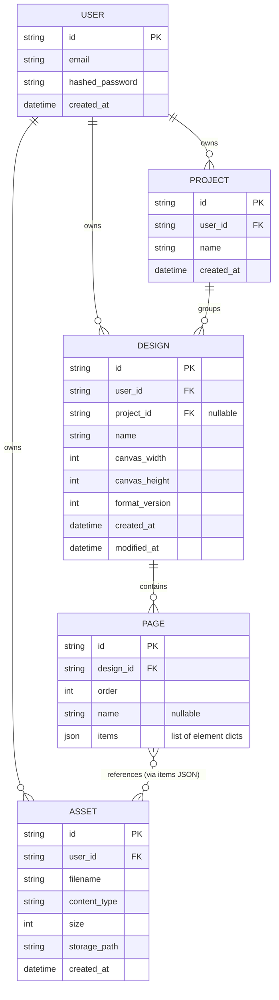

# Backend

FastAPI web API for CanixPy. Optional — the desktop app does not depend on this.

## Running

```bash
cd backend
pip install -r requirements.txt
uvicorn app.main:app --reload
```

Server runs at http://127.0.0.1:8000 — docs at http://127.0.0.1:8000/docs, health check at http://127.0.0.1:8000/health.

## Data Model

Single-user cloud sync scope: every record is owned by exactly one `User`, no cross-user sharing yet.

```
User ──┬──▶ Project ──▶ Design ──▶ Page ──▶ items[] (rect/ellipse/text/image/group)
        │                  ▲                        │
        │                  │ (project_id nullable —  │ image elements
        │                  │  a Design can be         │ reference an
        │                  │  ungrouped)               ▼
        └──────────────────┴───────────────────▶ Asset
```



**Design notes**

- `Page.items` holds the same element shape `desktop_app`'s `serialize_page()` already produces (`{kind, x, y, z, rotation, ...}` per rect/ellipse/polygon/text/image/group) — one JSON blob per page rather than a normalized element table, so desktop ⇄ backend sync is a straight JSON translation.
- `Asset` exists because `desktop_app` embeds images as base64 (`png_base64`) inline in the JSON — the backend instead stores image bytes via `Asset` and elements reference it by `asset_id`, so that reference is a lookup key inside the `items` JSON, not a real foreign key the database enforces.
- Each domain owns its model at `backend/app/<domain>/models.py` (`users/`, `projects/`, `designs/`, `pages/`, `assets/`) — see the [root README](../README.md) for how this fits into the whole repo.
